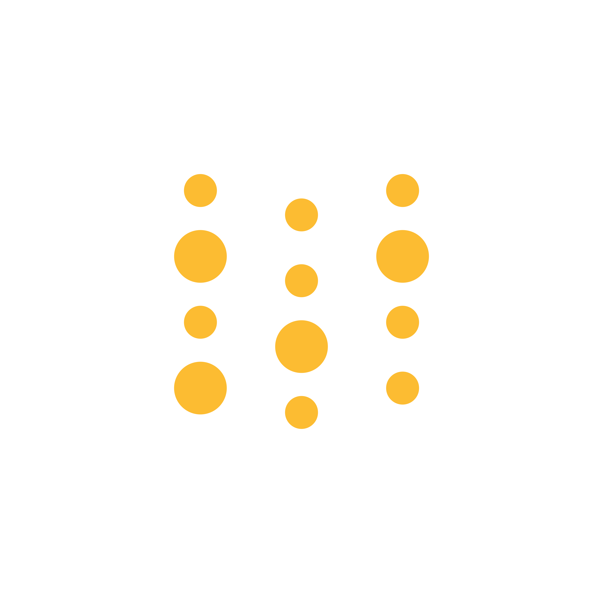
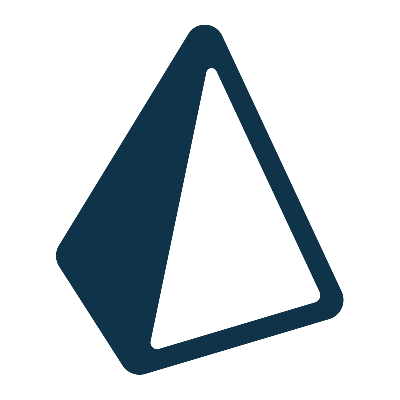

<h1>Hi 👋, I'm Abhinav Mangalore</h1>

Full-Stack Web Developer | Specializing in Machine Learning, Deep Learning, Computer Vision, NLP, and MLOps

<h2>🚀 Languages and Tools I Use</h2>
<table>
<tr>
<th> Category </th>
<th> Technologies </th>
</tr>
<tr>
<td>Programming & Scripting Languages</td>
<td>

</td>
</tr>

<tr> 
<td>AI/ML, Data Science and MLOps</td>
<td>

</td>

</tr>
<tr>
<td>
Frontend & UI/UX Development
</td>
<td>

</td>

<tr>
<td>
Backend & Database Technologies
</td>
<td>

</td>
</tr>
<tr>
<td>DevOps & Cloud</td>
<td>

</td>
</tr>
<tr>
<td>Miscellaneous Tools (Vizn, Testing, etc.)</td>
<td>

</td>

</tr>
<tr>
<td>
IoT & Hardware
</td>
<td>

</td>
</table>

<h2>⚡️ Where to find me</h2>

<!-- 

 -->

  <h2 style="margin-bottom: 12px; font-family: Arial, sans-serif; color: #0a77b6;">📄 My Résumé</h2>
  
Want to know more about my skills and experience?

  <a href="https://drive.google.com/file/d/1plXV3c298jaypy7V7CGTHbB6ZN2o2etc/view?usp=sharing" target="_blank" style="display: inline-block; padding: 10px 20px; background: #0a77b6; color: #fff; text-decoration: none; font-family: Arial, sans-serif; font-size: 16px; border-radius: 8px; box-shadow: 0 3px 5px rgba(0, 0, 0, 0.2);">
    View My Résumé
  </a>

<picture>
  <source media="(prefers-color-scheme: dark)" srcset="https://github.com/AbhinavMangalore16/AbhinavMangalore16/blob/output/github-snake-dark.svg" />
  <source media="(prefers-color-scheme: light)" srcset="https://github.com/AbhinavMangalore16/AbhinavMangalore16/blob/output/github-snake.svg" />
  
</picture>
